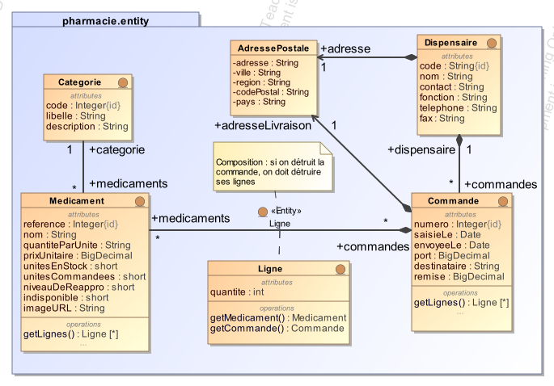
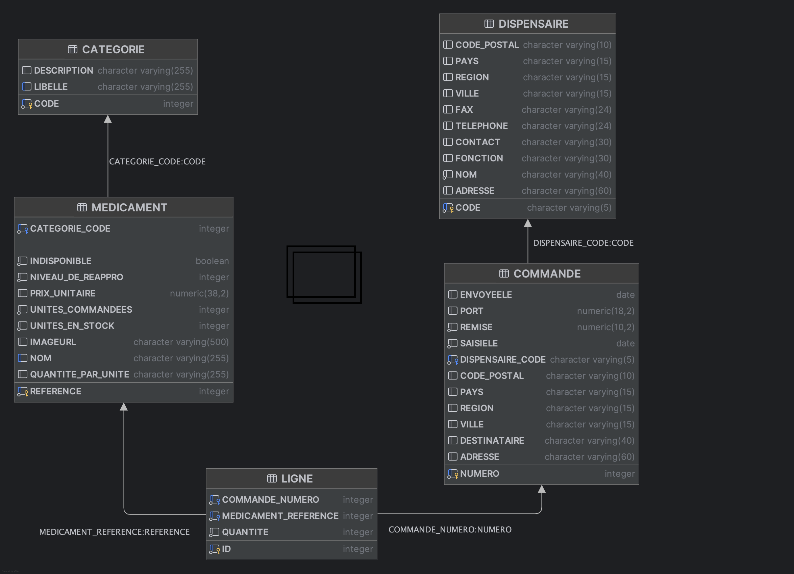

# Spring Boot Application - Gestion Pharmaceutique

## Conception et test d'un "Service métier"

On se propose de développer le service métier permettant de gérer les commandes pour la pharmacie.
Les spécifications précises du service à développer sont explicitées dans le javadoc des méthodes
de la classe [CommandeService](./src/main/java/pharmacie/service/CommandeService.java). Les [tests unitaires](./src/test/java/pharmacie/service) fournis devront vérifier que ces règles métier sont bien respectées.

## Modèles de données

Le *modèle conceptuel de données* (UML/JPA) est le suivant :



Spring Data JPA va générer automatiquement le *modèle logique de données* (relationnel) suivant, conformément aux annotations des classes-entités :



Notes :

- Dans la table `Produit`, le champ `unitesCommandees` représente le nombre d'unités "en commande", c'est à dire présentes dans des commandes qui n'ont pas encore été envoyées.
- Dans la table `Produit`, le champ `unitesEnStock` représente le nombre d'unités "en stock". Contrainte métier : la quantité en stock ne doit jamais être inférieure à la quantité en commande.
- Dans la table `Commande`, le champ `envoyeele` indique si la commande a été envoyée ou non (null si pas envoyée). Quand une commande est envoyée, la date d'envoi est enregistrée dans ce champ, les médicaments référencés dans la commande ne sont plus "en stock" ni "en commande".


### Couche "Services métier"

Cette couche définit les services métier transactionnels qui utilisent la couche "Accès aux données" pour effectuer des opérations complexes.

- [CommandeService](src/main/java/comptoirs/service/CommandeService.java): Gère les commandes de médicaments en assurant le respect des règles métier (vérification des stocks, calcul des totaux, gestion des dispensaires).

## TODO
1. Implementer les méthodes de la classe [`CommandeService`](./src/main/java/pharmacie/service/CommandeService.java).
2. Ecrire les tests unitaires vérifiant que les règles métier sont bien respectées pour toutes les méthodes de la classe [`CommandeService`](./src/main/java/pharmacie/service/CommandeService.java).

Note : les tests unitaires sont configurés pour utiliser un jeu de données spécifique, spécifié dans le fichier [application.properties](./src/test/resources/application.properties), qui référence le fichier [test_data.sql](./src/test/resources/test_data.sql).

## Démarrage de l'application

### Prérequis
- Java 21 LTS installé
- Maven 3.6+

### Lancer l'application
```bash
mvn clean spring-boot:run
```

L'application démarre sur le port **8080** : [http://localhost:8080](http://localhost:8080)

## Documentation
Consultez la documentation officielle pour mieux comprendre les technologies utilisées dans ce projet :

- **[Spring Boot 3.x Documentation](https://docs.spring.io/spring-boot/docs/current/reference/html/)**: Documentation complète de Spring Boot.
- **[Spring Data JPA](https://docs.spring.io/spring-data/jpa/reference/)**: Documentation sur l'intégration de JPA avec Spring.
- **[Jakarta Persistence](https://jakarta.ee/specifications/persistence/3.1/)**: Spécification Jakarta Persistence API 3.1.
- **[SpringDoc OpenAPI](https://springdoc.org/)**: Documentation pour SpringDoc OpenAPI.

## Guides Utiles
Voici des tutoriels pour démarrer avec les technologies Spring utilisées dans ce projet :

- **[Accessing Data with JPA](https://spring.io/guides/gs/accessing-data-jpa/)**: Accès aux données avec Spring Data JPA.
- **[Building a RESTful Web Service](https://spring.io/guides/gs/rest-service/)**: Création d'un service web RESTful avec Spring Boot.
